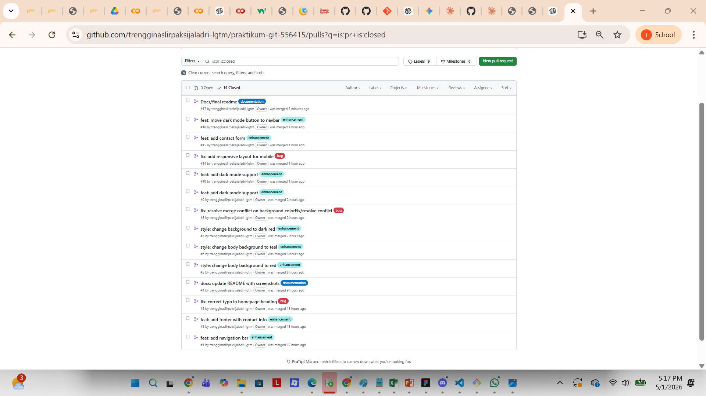
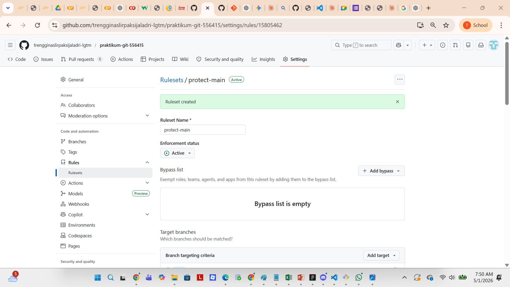
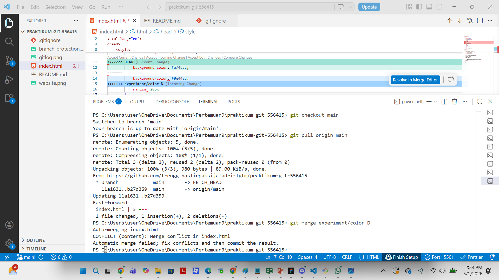
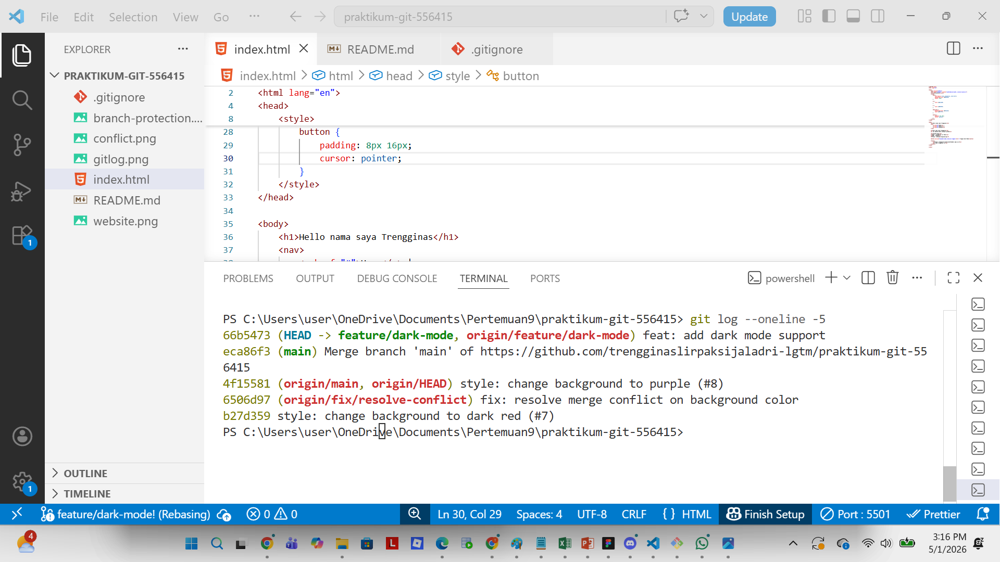
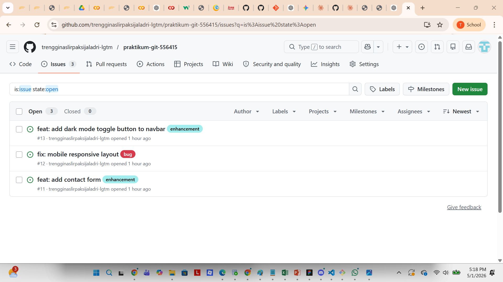
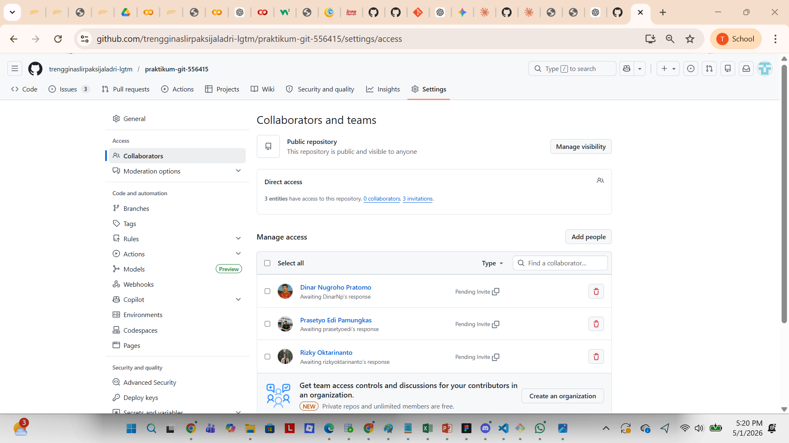
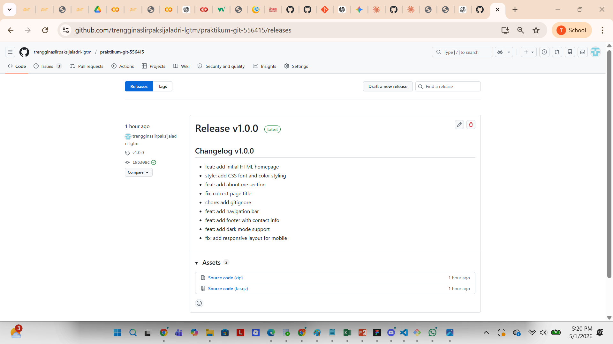

# Laporan Praktikum Git & GitHub
**Nama:** Trengginas Lir  
**NIM:** 25/556415/SV/25930  
**Kelas:** A2  
**Mata Kuliah:** Praktikum Pemrograman Web 1  
**Dosen Pembimbing:** Dinar Nugroho Pratomo, S.Kom., M.IM., M.Cs.

---

## Deskripsi Project
Project ini merupakan website portofolio sederhana yang dikembangkan sebagai media pembelajaran Git & GitHub. Website dibangun menggunakan HTML dan CSS murni, menampilkan informasi pribadi, navigasi, footer, dan fitur dark mode. Seluruh proses pengembangan didokumentasikan melalui Git dengan menerapkan berbagai konsep seperti branching, pull request, penyelesaian konflik, dan rebase.

---

## Alat dan Teknologi yang Digunakan
- **Git** — Version control system untuk melacak perubahan kode
- **GitHub** — Platform hosting repository berbasis cloud
- **Visual Studio Code** — Code editor utama
- **HTML & CSS** — Bahasa markup dan styling untuk membangun website

---

## Screenshot Website

---

## Tugas 1 - Inisialisasi & Commit History

### Tujuan
Memahami cara menginisialisasi repository Git, melakukan commit dengan pesan yang mengikuti konvensi Conventional Commits, serta menggunakan file `.gitignore`.

### Langkah-langkah

**1. Membuat Repository di GitHub**  
Pertama-tama, membuat repository baru di GitHub dengan nama `praktikum-git-556415` dan mengatur visibility menjadi Public agar dapat diakses oleh dosen dan asisten.

**2. Melakukan Clone Repository**  
Setelah repository dibuat, dilakukan proses clone ke komputer lokal menggunakan perintah berikut:
git clone https://github.com/trengginaslirpaksijaladri-lgtm/praktikum-git-556415.git
Perintah `git clone` berfungsi untuk menyalin seluruh isi repository dari GitHub ke komputer lokal beserta history commitnya.

**3. Membuat File index.html**  
Membuat file `index.html` yang berisi struktur halaman web sederhana dengan elemen heading, paragraf, navigasi, dan informasi pribadi. File ini menjadi halaman utama dari website portofolio.

**4. Melakukan 5 Commit dengan Conventional Commits**  
Setiap perubahan pada file dicatat menggunakan perintah `git add` dan `git commit`. Format pesan commit yang digunakan mengikuti konvensi Conventional Commits, yaitu:
- `feat:` untuk penambahan fitur baru
- `fix:` untuk perbaikan bug
- `style:` untuk perubahan tampilan
- `chore:` untuk tugas maintenance

Berikut adalah 5 commit yang dilakukan:
feat: add initial HTML homepage
feat: add heading to homepage
style: add CSS font and color styling
feat: add about me section
fix: correct page title to match content

**5. Membuat File .gitignore**  
Membuat file `.gitignore` untuk mengecualikan file-file yang tidak perlu di-track oleh Git, seperti file sistem operasi dan dependency. Isi file `.gitignore`:
.DS_Store
*.log
node_modules/
Kemudian melakukan commit dengan pesan `chore: add gitignore`.

**6. Melakukan Push ke GitHub**  
Setelah semua commit selesai, mengirimkan seluruh perubahan ke GitHub menggunakan:
git push origin main

### Hasil
Berikut adalah hasil `git log --oneline --graph` yang menunjukkan history commit:

---

## Tugas 2 - Branching & Pull Request

### Tujuan
Memahami konsep branching dalam Git, cara membuat Pull Request di GitHub, strategi merge yang berbeda, serta penerapan Branch Protection Rule.

### Langkah-langkah

**1. Membuat Branch `feature/navbar`**  
Membuat branch baru untuk menambahkan fitur navigasi menggunakan perintah:
git checkout -b feature/navbar
Perintah `git checkout -b` digunakan untuk membuat branch baru sekaligus langsung berpindah ke branch tersebut. Setelah menambahkan elemen `<nav>` pada `index.html`, dilakukan commit dan push:
git add .
git commit -m "feat: add navigation bar"
git push origin feature/navbar

**2. Membuat Branch `feature/footer`**  
Kembali ke branch main terlebih dahulu menggunakan `git checkout main`, kemudian membuat branch baru untuk menambahkan footer:
git checkout -b feature/footer
Menambahkan elemen `<footer>` berisi informasi kontak pada `index.html`, kemudian melakukan commit dan push ke GitHub.

**3. Membuat Branch `hotfix/typo`**  
Membuat branch khusus untuk memperbaiki typo pada halaman utama:
git checkout -b hotfix/typo
Memperbaiki typo pada heading, kemudian melakukan commit dengan pesan `fix: correct typo in homepage heading` dan push ke GitHub.

**4. Membuat Pull Request**  
Untuk setiap branch, dibuat Pull Request di GitHub dengan melengkapi:
- **Judul** yang deskriptif sesuai perubahan
- **Deskripsi** yang menjelaskan apa yang diubah
- **Label** yang sesuai (`enhancement` untuk feature, `bug` untuk hotfix)

### Screenshot Pull Request

**5. Melakukan Merge**  
Strategi merge yang digunakan berbeda untuk setiap jenis branch:
- **Squash and merge** → digunakan untuk `feature/navbar` dan `feature/footer` agar history commit lebih bersih
- **Merge commit** → digunakan untuk `hotfix/typo` agar history perbaikan tetap tercatat

**6. Memasang Branch Protection Rule**  
Mengaktifkan Branch Protection Rule pada branch `main` melalui Settings → Rules → Rulesets dengan konfigurasi:
- Ruleset Name: `protect-main`
- Enforcement status: Active
- Target branch: `main`
- Rule: Require a pull request before merging

Dengan aturan ini, tidak ada yang dapat melakukan push langsung ke branch `main` tanpa melalui Pull Request terlebih dahulu.

### Screenshot Branch Protection

---

## Tugas 3 - Konflik & Rebase

### Tujuan
Memahami cara menangani konflik merge secara manual di VS Code serta menggunakan interactive rebase untuk menggabungkan beberapa commit menjadi satu.

### Langkah-langkah Simulasi Konflik

**1. Membuat Dua Branch dengan Perubahan yang Sama**  
Membuat branch `experiment/color-C` dari main:
git checkout -b experiment/color-C
Mengubah nilai `background-color` pada `body` di CSS menjadi `#e74c3c` (merah gelap), kemudian melakukan commit dan push.

Kembali ke main, lalu membuat branch `experiment/color-D`:
git checkout -b experiment/color-D
Mengubah baris CSS yang sama dengan nilai berbeda yaitu `#8e44ad` (ungu), kemudian melakukan commit dan push.

**2. Melakukan Merge Branch Pertama**  
Branch `experiment/color-C` di-merge ke main terlebih dahulu melalui Pull Request di GitHub menggunakan Squash and merge.

**3. Menimbulkan Konflik**  
Setelah branch C berhasil di-merge, dilakukan merge branch `experiment/color-D` ke main secara lokal:
git checkout main
git pull origin main
git merge experiment/color-D
Konflik terjadi karena kedua branch mengubah baris CSS yang sama dengan nilai yang berbeda.

**4. Menyelesaikan Konflik di VS Code**  
VS Code menampilkan marker konflik sebagai berikut:
<<<<<<< HEAD
background-color: #e74c3c;
background-color: #8e44ad;

experiment/color-D

Konflik diselesaikan secara manual dengan memilih **Accept Incoming Change** untuk menggunakan warna ungu (`#8e44ad`). Setelah konflik diselesaikan, dilakukan commit:
git add .
git commit -m "fix: resolve merge conflict on background color"

### Screenshot Konflik

### Langkah-langkah Interactive Rebase

**1. Membuat Branch dan 3 Commit**  
Membuat branch `feature/dark-mode` dan membuat 3 commit terpisah:
git checkout -b feature/dark-mode
git commit -m "wip: add dark mode CSS"
git commit -m "wip: add dark mode toggle button"
git commit -m "wip: style dark mode button"

**2. Menjalankan Interactive Rebase**  
Menggabungkan 3 commit menjadi 1 menggunakan:
git rebase -i HEAD~3
Pada editor yang muncul, mengubah `pick` menjadi `s` (squash) pada commit ke-2 dan ke-3:
pick xxxx wip: add dark mode CSS
s xxxx wip: add dark mode toggle button
s xxxx wip: style dark mode button
Kemudian menuliskan pesan commit baru yang lebih baik:
feat: add dark mode support

**3. Push Hasil Rebase**  
Setelah rebase selesai, melakukan push ke GitHub dan membuat Pull Request untuk di-merge ke main.

### Screenshot Rebase

---

## Tugas 4 - Dokumentasi & Invite

### Tujuan
Melengkapi dokumentasi project, membuat dan menutup Issues, mengundang collaborator, serta membuat Release.

### Langkah-langkah

**1. Melengkapi README.md**  
Melengkapi file README.md dengan deskripsi project, cara menjalankan, screenshot website, dan dokumentasi perintah Git yang digunakan.

**2. Membuat dan Menutup Issues**  
Membuat 3 Issues di GitHub:
- Issue #1: `feat: add contact form` (label: enhancement)
- Issue #2: `fix: mobile responsive layout` (label: bug)
- Issue #3: `feat: add dark mode toggle button to navbar` (label: enhancement)

Setiap issue ditutup dengan Pull Request yang menyertakan kata kunci `Closes #nomor` pada deskripsi PR, sehingga issue otomatis tertutup saat PR di-merge.

### Screenshot Issues

**3. Mengundang Collaborator**  
Mengundang dosen dan asisten sebagai collaborator melalui Settings → Collaborators → Add people:
- Dosen: `dinarnp`
- Asisten 1: `prasetyoedi`
- Asisten 2: `rizkyoktarinanto`

### Screenshot Collaborator

**4. Membuat Release v1.0.0**  
Membuat Release pertama di GitHub melalui Releases → Draft a new release dengan:
- Tag: `v1.0.0`
- Title: `Release v1.0.0`
- Changelog berisi daftar semua fitur yang telah dikembangkan

### Screenshot Release

---

## Dokumentasi Perintah Git

### `git clone <url>`
Digunakan untuk menyalin repository dari GitHub ke komputer lokal beserta seluruh history commitnya. Perintah ini hanya digunakan sekali di awal untuk mendapatkan salinan repository.  
**Contoh:** `git clone https://github.com/trengginaslirpaksijaladri-lgtm/praktikum-git-556415.git`

### `git add <file>`
Digunakan untuk menambahkan file ke staging area, yaitu area persiapan sebelum melakukan commit. Perintah `git add .` digunakan untuk menambahkan semua perubahan sekaligus, sedangkan `git add <nama-file>` untuk menambahkan file tertentu saja.  
**Contoh:** `git add index.html` atau `git add .`

### `git commit -m "pesan"`
Digunakan untuk menyimpan snapshot perubahan ke history Git secara permanen di lokal. Pesan commit sebaiknya mengikuti format Conventional Commits agar history mudah dibaca.  
**Contoh:** `git commit -m "feat: add navigation bar"`

### `git push origin <branch>`
Digunakan untuk mengirimkan commit dari lokal ke GitHub sehingga dapat dilihat dan diakses oleh orang lain. `origin` merujuk pada URL repository GitHub, sedangkan `<branch>` adalah nama branch yang dikirim.  
**Contoh:** `git push origin main` atau `git push origin feature/navbar`

### `git pull origin <branch>`
Digunakan untuk mengunduh perubahan terbaru dari GitHub dan menggabungkannya ke branch lokal. Perintah ini penting dijalankan sebelum memulai pekerjaan baru agar kode selalu sinkron dengan versi terbaru.  
**Contoh:** `git pull origin main`

### `git checkout -b <branch>`
Digunakan untuk membuat branch baru sekaligus langsung berpindah ke branch tersebut dalam satu perintah. Branch digunakan untuk mengembangkan fitur secara terpisah tanpa mengganggu branch utama.  
**Contoh:** `git checkout -b feature/navbar`

### `git merge <branch>`
Digunakan untuk menggabungkan perubahan dari branch lain ke branch yang sedang aktif. Jika terdapat perubahan yang bertentangan pada baris yang sama, Git akan menampilkan konflik yang harus diselesaikan secara manual.  
**Contoh:** `git merge experiment/color-C`

### `git rebase -i HEAD~3`
Digunakan untuk mengubah history commit secara interaktif. Perintah ini memungkinkan penggabungan (squash) beberapa commit menjadi satu commit yang lebih rapi, sehingga history repository lebih bersih dan mudah dibaca.  
**Contoh:** `git rebase -i HEAD~3` → menggabungkan 3 commit terakhir menjadi 1 commit

### `git log --oneline --graph`
Digunakan untuk menampilkan history commit dalam bentuk ringkas satu baris beserta visualisasi graph percabangan branch. Sangat berguna untuk melihat alur pengembangan secara keseluruhan.  
**Contoh output:**

a1b2c3d (HEAD -> main) feat: add dark mode support
b2c3d4e fix: resolve merge conflict
c3d4e5f feat: add navigation bar

### `git status`
Digunakan untuk menampilkan status file saat ini, meliputi file yang sudah di-staging, belum di-staging, maupun belum di-track oleh Git. Perintah ini sering digunakan untuk memastikan file yang akan di-commit sudah benar.

### `git branch -a`
Digunakan untuk menampilkan semua branch yang tersedia, baik di lokal maupun di remote GitHub. Berguna untuk memantau branch apa saja yang sedang aktif dalam repository.

### `git config --global user.name` dan `git config --global user.email`
Digunakan untuk mengatur identitas pengguna Git secara global. Identitas ini akan tercatat pada setiap commit yang dilakukan sehingga dosen dapat mengetahui siapa yang melakukan commit tersebut.  
**Contoh:**
git config --global user.name "Trengginas Lir"
git config --global user.email "trengginaslirpaksijaladri@mail.ugm.ac.id"

---

## Kesimpulan
Melalui praktikum ini, telah dipelajari dan dipraktikkan penggunaan Git dan GitHub secara menyeluruh, meliputi inisialisasi repository, pengelolaan commit dengan Conventional Commits, branching dan pull request, penyelesaian konflik merge secara manual, serta penggunaan interactive rebase untuk merapikan history commit. Seluruh konsep tersebut merupakan dasar yang sangat penting dalam pengembangan perangkat lunak secara kolaboratif dan profesional.